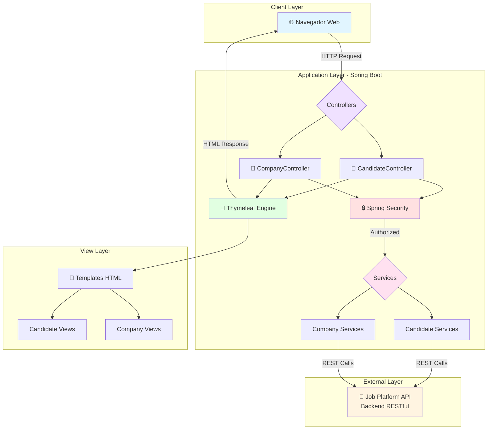
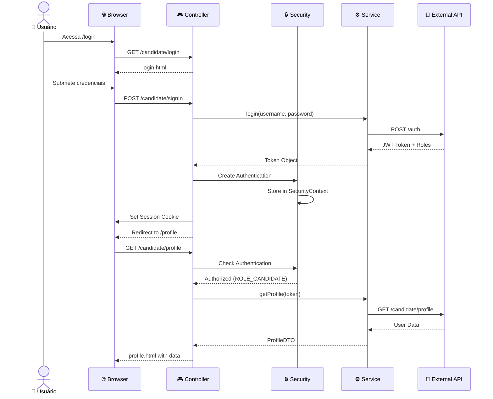
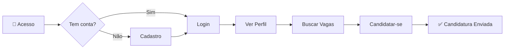
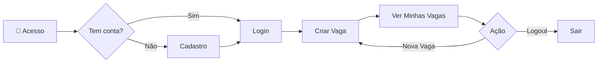

# 🚀 Job Platform - Thymeleaf

<div align="center">

[](https://www.java.com/pt-BR/)
[](https://spring.io/)
[](https://www.thymeleaf.org/)
[](https://maven.apache.org/)
[](https://github.com/patrick-cuppi/job-platform-thymeleaf/blob/main/LICENSE)

Uma plataforma completa de gestão de vagas de emprego desenvolvida com Spring Boot e Thymeleaf, oferecendo interfaces separadas para candidatos e empresas.

[Funcionalidades](#-funcionalidades) •
[Tecnologias](#-tecnologias) •
[Arquitetura](#-arquitetura) •
[Instalação](#-instalação) •
[Uso](#-uso) •
[Rotas](#-rotas-e-endpoints)

</div>

---

## 📋 Índice

- [Sobre o Projeto](#-sobre-o-projeto)
- [Funcionalidades](#-funcionalidades)
- [Tecnologias](#-tecnologias)
- [Arquitetura](#-arquitetura)
- [Pré-requisitos](#-pré-requisitos)
- [Instalação](#-instalação)
- [Uso](#-uso)
- [Rotas e Endpoints](#-rotas-e-endpoints)
- [Templates](#-templates)
- [Estrutura do Projeto](#-estrutura-do-projeto)
- [Configuração](#-configuração)
- [Contribuindo](#-contribuindo)
- [Licença](#-licença)

---

## 🎯 Sobre o Projeto

O **Job Platform Thymeleaf** é uma aplicação web full-stack que conecta empresas e candidatos em um ambiente profissional de recrutamento. A plataforma oferece:

- 🏢 **Portal da Empresa**: Criação e gerenciamento de vagas
- 👤 **Portal do Candidato**: Busca e candidatura a vagas
- 🔐 **Autenticação Segura**: Sistema de login baseado em roles com Spring Security
- 🎨 **Interface Responsiva**: Templates Thymeleaf com design moderno
- 🔄 **Comunicação com API**: Integração com backend REST externo - [repositório aqui.](https://github.com/patrick-cuppi/job-platform)

---

## ✨ Funcionalidades

### 👨‍💼 Módulo Candidato

- ✅ Cadastro de novos candidatos
- 🔐 Login e autenticação
- 👤 Visualização de perfil pessoal
- 🔍 Busca de vagas com filtros
- 📝 Candidatura a vagas disponíveis
- 🛡️ Área protegida com autenticação

### 🏢 Módulo Empresa

- ✅ Cadastro de novas empresas
- 🔐 Login e autenticação
- ➕ Criação de novas vagas
- 📋 Listagem de vagas criadas pela empresa
- 🚪 Sistema de logout
- 🛡️ Área protegida com autenticação

---

## 🛠 Tecnologias

### Core
- **[Java 17](https://www.oracle.com/java/technologies/javase/jdk17-archive-downloads.html)** - Linguagem de programação
- **[Spring Boot 3.5.8](https://spring.io/projects/spring-boot)** - Framework de aplicação
- **[Maven](https://maven.apache.org/)** - Gerenciamento de dependências e build

### Framework e Bibliotecas
- **[Spring Web](https://spring.io/guides/gs/serving-web-content/)** - Desenvolvimento de aplicações web MVC
- **[Spring Security](https://spring.io/projects/spring-security)** - Autenticação e autorização
- **[Thymeleaf](https://www.thymeleaf.org/)** - Template engine para views
- **[Thymeleaf Spring Security 6](https://github.com/thymeleaf/thymeleaf-extras-springsecurity)** - Integração Thymeleaf + Security
- **[Lombok](https://projectlombok.org/)** - Redução de boilerplate code
- **[Spring DevTools](https://docs.spring.io/spring-boot/docs/current/reference/html/using.html#using.devtools)** - Hot reload e desenvolvimento

### Arquitetura
- **MVC (Model-View-Controller)** - Padrão arquitetural
- **Injeção de Dependências** - Spring IoC Container
- **Session-based Authentication** - Gerenciamento de sessões
- **REST Client** - Comunicação com API externa

---

## 🏗 Arquitetura



### Fluxo de Autenticação



---

## 📦 Pré-requisitos

Antes de começar, certifique-se de ter instalado em sua máquina:

| Ferramenta | Versão Mínima | Verificar Instalação |
|------------|---------------|---------------------|
| **Java JDK** | 17+ | `java -version` |
| **Maven** | 3.6+ | `mvn -version` |
| **Git** | 2.0+ | `git --version` |

### ⚠️ Requisitos Importantes

- **API Backend**: Este projeto requer uma API REST externa rodando, [clique aqui](https://github.com/patrick-cuppi/job-platform) para acessá-la. Configure a URL da API no `application.properties`
- **Porta 8081**: A aplicação roda por padrão na porta 8081. Certifique-se de que está disponível

---

## 🚀 Instalação

### 1️⃣ Clone o Repositório

```bash
git clone https://github.com/patrick-cuppi/job-platform-thymeleaf
cd job-platform-thymeleaf
```

### 2️⃣ Configure o Ambiente

Edite o arquivo `src/main/resources/application.properties`:

```properties
spring.application.name=job_platform_thymeleaf

# Porta da aplicação
server.port=8081

# URL da API Backend (IMPORTANTE!)
hostApiJobPlatform=http://localhost:8080
```

### 3️⃣ Compile o Projeto

```bash
mvn clean install
```

### 4️⃣ Execute a Aplicação

**Opção 1: Usando Maven**
```bash
mvn spring-boot:run
```

**Opção 2: Executando o JAR**
```bash
java -jar target/job_platform_thymeleaf-0.0.1-SNAPSHOT.jar
```

### 5️⃣ Acesse a Aplicação

A aplicação estará disponível em:
- 🌐 **URL**: http://localhost:8081
- 👤 **Login Candidato**: http://localhost:8081/candidate/login
- 🏢 **Login Empresa**: http://localhost:8081/company/login

---

## 💻 Uso

### Criar uma Conta de Candidato

1. Acesse http://localhost:8081/candidate/create
2. Preencha o formulário com seus dados
3. Clique em "Cadastrar"
4. Faça login em http://localhost:8081/candidate/login

### Criar uma Conta de Empresa

1. Acesse http://localhost:8081/company/create
2. Preencha o formulário com os dados da empresa
3. Clique em "Cadastrar"
4. Faça login em http://localhost:8081/company/login

### Buscar e Candidatar-se a Vagas

1. Faça login como candidato
2. Acesse o perfil e navegue até "Vagas"
3. Use os filtros para encontrar vagas
4. Clique em "Candidatar-se" na vaga desejada

### Criar uma Vaga (Como Empresa)

1. Faça login como empresa
2. Acesse "Criar Vaga"
3. Preencha as informações da vaga
4. Submeta o formulário
5. Visualize suas vagas em "Minhas Vagas"

---

## 🛣 Rotas e Endpoints

### 🔓 Rotas Públicas (Sem Autenticação)

| Método | Rota | Descrição |
|--------|------|-----------|
| `GET` | `/candidate/login` | Página de login do candidato |
| `POST` | `/candidate/signIn` | Autenticação do candidato |
| `GET` | `/candidate/create` | Formulário de cadastro de candidato |
| `POST` | `/candidate/create` | Criação de novo candidato |
| `GET` | `/company/login` | Página de login da empresa |
| `POST` | `/company/signIn` | Autenticação da empresa |
| `GET` | `/company/create` | Formulário de cadastro de empresa |
| `POST` | `/company/create` | Criação de nova empresa |

### 🔒 Rotas Protegidas - Candidato (Role: `CANDIDATE`)

| Método | Rota | Descrição |
|--------|------|-----------|
| `GET` | `/candidate/profile` | Perfil do candidato autenticado |
| `GET` | `/candidate/jobs` | Lista de vagas disponíveis |
| `GET` | `/candidate/jobs?filter={termo}` | Busca vagas com filtro |
| `POST` | `/candidate/jobs/apply` | Candidata-se a uma vaga |

**Parâmetros:**
- `filter` (query): Termo de busca para filtrar vagas
- `jobId` (form): UUID da vaga para candidatura

### 🔒 Rotas Protegidas - Empresa (Role: `COMPANY`)

| Método | Rota | Descrição |
|--------|------|-----------|
| `GET` | `/company/jobs` | Formulário de criação de vaga |
| `POST` | `/company/jobs` | Cria uma nova vaga |
| `GET` | `/company/jobs/list` | Lista todas as vagas da empresa |
| `GET` | `/company/logout` | Encerra sessão da empresa |

### 🔐 Sistema de Autenticação

O sistema utiliza **Session-based Authentication** com Spring Security:

1. **Login** → Credenciais enviadas para API externa
2. **Token JWT** → Recebido e armazenado na sessão
3. **Roles** → Convertidas para `GrantedAuthority` (ROLE_CANDIDATE ou ROLE_COMPANY)
4. **Session** → `SecurityContext` armazenado na sessão HTTP
5. **Autorização** → `@PreAuthorize` verifica roles em cada requisição

---

## 📄 Templates

Os templates Thymeleaf estão organizados por módulo:

### 👤 Templates do Candidato

| Template | Localização | Descrição |
|----------|-------------|-----------|
| **login.html** | `templates/candidate/login.html` | Formulário de login |
| **create.html** | `templates/candidate/create.html` | Cadastro de novo candidato |
| **profile.html** | `templates/candidate/profile.html` | Perfil do candidato com informações pessoais |
| **jobs.html** | `templates/candidate/jobs.html` | Listagem e busca de vagas |

### 🏢 Templates da Empresa

| Template | Localização | Descrição |
|----------|-------------|-----------|
| **login.html** | `templates/company/login.html` | Formulário de login |
| **create.html** | `templates/company/create.html` | Cadastro de nova empresa |
| **jobs.html** | `templates/company/jobs.html` | Formulário de criação de vaga |
| **list.html** | `templates/company/list.html` | Lista de vagas criadas |

### 🎨 Recursos dos Templates

- ✅ Integração completa com Spring Security (`sec:authorize`)
- ✅ Binding de formulários com objetos Java
- ✅ Mensagens de erro formatadas
- ✅ Validação client-side e server-side
- ✅ Suporte a atributos dinâmicos do modelo

---

## 📁 Estrutura do Projeto

```
job_platform_thymeleaf/
├── 📄 pom.xml                          # Configuração Maven
├── 📄 README.md                        # Documentação
├── 📄 LICENSE                          # Licença do projeto
│
├── 📂 src/main/java/
│   └── 📂 br/com/patrickcuppi/job_platform_thymeleaf/
│       ├── 📄 JobPlatformThymeleafApplication.java    # Classe principal
│       │
│       ├── 📂 modules/
│       │   ├── 📂 candidate/                          # Módulo Candidato
│       │   │   ├── 📂 controller/
│       │   │   │   └── 📄 CandidateController.java    # Controlador de rotas
│       │   │   ├── 📂 dto/
│       │   │   │   ├── 📄 CreateCandidateDTO.java     # DTO de criação
│       │   │   │   ├── 📄 ProfileUserDTO.java         # DTO de perfil
│       │   │   │   ├── 📄 JobDTO.java                 # DTO de vaga
│       │   │   │   └── 📄 Token.java                  # DTO de autenticação
│       │   │   └── 📂 service/
│       │   │       ├── 📄 CandidateService.java       # Login
│       │   │       ├── 📄 CreateCandidateService.java # Criação
│       │   │       ├── 📄 ProfileCandidateService.java# Perfil
│       │   │       ├── 📄 FindJobsService.java        # Busca vagas
│       │   │       └── 📄 ApplyJobService.java        # Candidatura
│       │   │
│       │   └── 📂 company/                            # Módulo Empresa
│       │       ├── 📂 controller/
│       │       │   └── 📄 CompanyController.java      # Controlador de rotas
│       │       ├── 📂 dto/
│       │       │   ├── 📄 CreateCompanyDTO.java       # DTO de criação
│       │       │   └── 📄 CreateJobsDTO.java          # DTO de vaga
│       │       └── 📂 service/
│       │           ├── 📄 LoginCompanyService.java    # Login
│       │           ├── 📄 CreateCompanyService.java   # Criação
│       │           ├── 📄 CreateJobService.java       # Criar vaga
│       │           └── 📄 ListAllJobsCompanyService.java # Listar vagas
│       │
│       ├── 📂 security/
│       │   └── 📄 SecurityConfig.java                 # Configuração de segurança
│       │
│       └── 📂 utils/
│           └── 📄 FormatErrorMessage.java             # Utilitários
│
├── 📂 src/main/resources/
│   ├── 📄 application.properties                      # Configurações
│   ├── 📂 static/                                     # Recursos estáticos (CSS, JS, Imagens)
│   └── 📂 templates/                                  # Templates Thymeleaf
│       ├── 📂 candidate/
│       │   ├── 📄 login.html
│       │   ├── 📄 create.html
│       │   ├── 📄 profile.html
│       │   └── 📄 jobs.html
│       └── 📂 company/
│           ├── 📄 login.html
│           ├── 📄 create.html
│           ├── 📄 jobs.html
│           └── 📄 list.html
│
└── 📂 src/test/java/                                  # Testes unitários
```

---

## ⚙️ Configuração

### application.properties

```properties
# Nome da Aplicação
spring.application.name=job_platform_thymeleaf

# Porta do Servidor
server.port=8081

# URL da API Backend (Substitua pela URL real)
hostApiJobPlatform=http://localhost:8080

# Thymeleaf (Configurações padrão do Spring Boot)
# spring.thymeleaf.cache=false  # Desabilitar cache em desenvolvimento

# Logging (Opcional)
# logging.level.br.com.patrickcuppi=DEBUG
```

### Variáveis de Ambiente (Opcional)

Para ambientes de produção, use variáveis de ambiente:

```bash
export SERVER_PORT=8081
export HOST_API_JOB_PLATFORM=https://api.production.com
```

E atualize `application.properties`:
```properties
server.port=${SERVER_PORT:8081}
hostApiJobPlatform=${HOST_API_JOB_PLATFORM:http://localhost:8080}
```

---

## 🔒 Segurança

### Configurações de Segurança

- ✅ **Spring Security 6** com autenticação baseada em sessão
- ✅ **CSRF Protection** habilitado
- ✅ **Role-based Authorization** (`CANDIDATE` e `COMPANY`)
- ✅ **Session Management** com cookies HTTP
- ✅ **Password Encoding** delegado à API externa
- ⚠️ **Tokens JWT** armazenados em sessão (considere alternativas para produção)

### Rotas Públicas vs Protegidas

```java
// Rotas públicas (não requerem autenticação)
- /candidate/login
- /candidate/signIn
- /candidate/create
- /company/login
- /company/signIn
- /company/create

// Rotas protegidas (requerem autenticação)
- /candidate/** (ROLE_CANDIDATE)
- /company/** (ROLE_COMPANY)
```

---

## 🧪 Testes

Execute os testes com:

```bash
mvn test
```

Para executar com relatório de cobertura:

```bash
mvn clean test jacoco:report
```

---

## 📊 Fluxos de Negócio

### Fluxo do Candidato



### Fluxo da Empresa



---

## 🐛 Troubleshooting

### Problema: Erro de conexão com API

**Solução:**
- Verifique se a API backend está rodando
- Confirme a URL em `application.properties`
- Verifique logs de rede no console

### Problema: Porta 8081 já em uso

**Solução:**
```bash
# Linux/Mac
lsof -ti:8081 | xargs kill -9

# Windows
netstat -ano | findstr :8081
taskkill /PID <PID> /F
```

Ou altere a porta em `application.properties`:
```properties
server.port=8082
```

### Problema: Erro de compilação Maven

**Solução:**
```bash
mvn clean install -U
```

---

## 🤝 Contribuindo

Contribuições são bem-vindas! Siga os passos:

1. Fork o projeto
2. Crie uma branch para sua feature (`git checkout -b feature/AmazingFeature`)
3. Commit suas mudanças (`git commit -m 'Add some AmazingFeature'`)
4. Push para a branch (`git push origin feature/AmazingFeature`)
5. Abra um Pull Request

### Diretrizes de Contribuição

- ✅ Siga o padrão de código existente
- ✅ Adicione testes para novas funcionalidades
- ✅ Atualize a documentação conforme necessário
- ✅ Use commits semânticos

---

## 📝 Licença

Este projeto está sob a licença MIT. Veja o arquivo [LICENSE](https://github.com/patrick-cuppi/job-platform-thymeleaf/blob/main/LICENSE) para mais detalhes.

---

## 👨‍💻 Autor

**Patrick Cuppi**

- GitHub: [@patrickcuppi](https://github.com/patrick-cuppi)
- LinkedIn: [Patrick Cuppi](https://www.linkedin.com/in/patrick-cuppi/)

---

<div align="center">

**[⬆ Voltar ao topo](#-job-platform-thymeleaf)**

### ⭐ Se este projeto te ajudou, considere dar uma estrela!

**Desenvolvido com ❤️ usando Spring Boot**

</div>